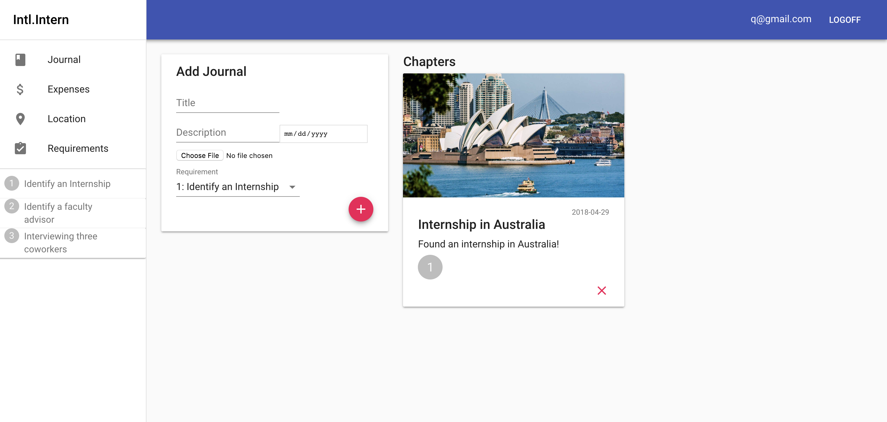
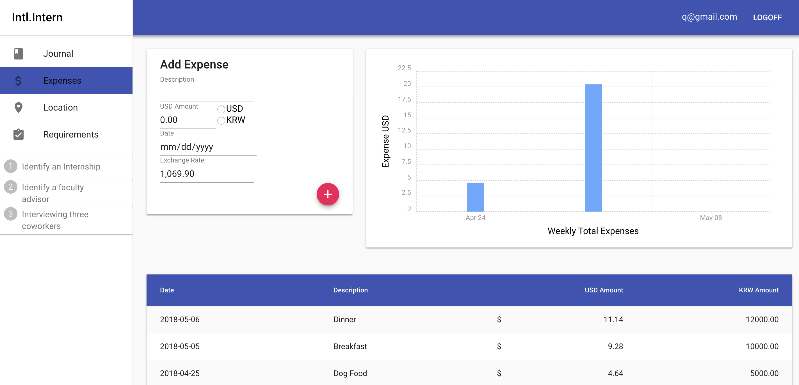
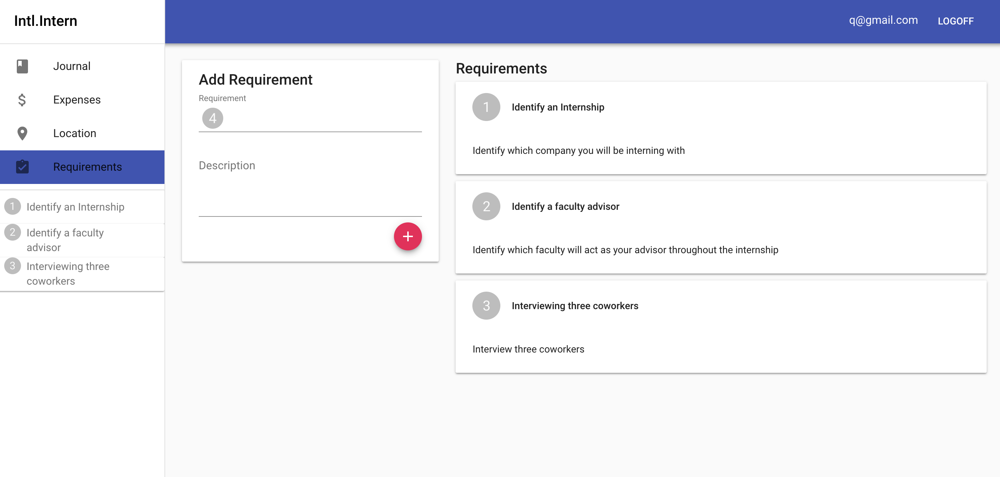

# Intl.Intern
## An Internship tracking tool

## Table of Contents
* [View Live Site](#view-live-site)
* [Contributors](#contributors)
* [About this project](#about-this-project)

## <a name="view-live-site"></a> View Live Site
[https://international-intern.herokuapp.com/](https://international-intern.herokuapp.com/)


## <a name="contributors"></a>Contributors
Intl.Intern was created by the Go Go Gadget Team at the University of Minnesota Coding Bootcamp.
[Christopher Biessener](https://github.com/scorpiosoft)
[Dani Carter](https://github.com/danielaine3)
[Susan Marek](https://github.com/sjbmarek)
[Joseph Semlak](https://github.com/semlak)
[Jeff Studenski](https://github.com/jstudenski)

## <a name="about-this-project"></a> About this project
Tens of thousands of college students across the US travel abroad for internship or study abroad opportunities every year. With each of these opportunities typically come requirements from the university, internship program or personal goals the students would like to reach. Managing that inormation while in a foreign country can be tedious and challenging. 

Intl.Intern works to make managing and reaching goals and requirements easier than ever. Add requirements of the internship, study abroad program or personal goals to the app and track your progress by adding chapters to your journal and tying them to the requirements. Additionally, keep track of your expenses in the local currency and US dollars on the expenses. Finally, always know what is happening locally on the location page where you can view a local map, current weather, exchange rate, timezone information and local news. 

* [How It Works](#how-it-works)
* [Technologies Used](#technologies-used)
* [Structure of Project](#structure)
* [Start Locally](#start-locally)

## <a name="how-it-works"></a> How It Works
1. Create Profile

Create a user profile with details of your home location and internship locations such as city, country and currency code. 

2. Jornal Page

 Keep track of milestones hit and requirements met by creating chapters in your personal journal page:
    * Add a chapter by entering a title, description and date. Additional optional fields include a picture and requirement number met
    * Delete a chapter
    
3. Expenses Page

* Keep track of expenses throughout your internship :
    * Log expense in US dollars or local currency using the expense tracking form
    * View a day-by-day ledger with both local currency and US Dollars noted or a graphical representation of expenses by week
    
4. Location Page

* View information about your internship location. Available information includes:
    * Local Map
    * Local Weather
    * Currency exchange rates
    * Timezone information
    * New York Times News 
    
5. Requirements Page

* Keep track of internship requirements set by your university or self by creating them on your requirements page
    * Add a requirement by entering a title and description
    * Conveniently view requirements below your pages on the side navigation

## <a name="technologies-used"></a> Technologies Used
* FRONTEND
    * HTML
    * CSS
    * Material-UI Next 
    * Javascript
    * React

* BACKEND
    * Node.js
    * MongoDB
    * Express
    * Mongoose ORM
    * JavaScript
    * Firebase
    * Chartist.js
        
    *  APIs Used
        * CurrencyLayer
        * GoogleMaps
        * NYTimes
        * OpenWeather
        * Firebase
        
## <a name="structure"></a> Structure of Project
After you clone the reposity, navigate to the root directory (project-three). The project directory structure is set up as follows: 

* Server.js: This file:
    * Defines and requiers the dependencies, including axios, express, body-parser, morgan logger, mongoose, passport
    * Sets up the Express server
    * Sets up the Express server to handle data parsing use body-parser
    * Sets up the logger
    * Sets up passport
    * Points the server to the API routes
    * Defines the port the server is listening on
    * Starts the server
    * Allows the app to serve static conten from the public directory

* models: Contains chapter.js, expense.js, index.js, needs.js and user.js files which contain the information for the application to set up the database

* controllers: Contains chaptersController.js, countryConroller.js, expenseController.js, needsController.js and usersController.js which contain the information fo the various pages for the application to interact with the database

* routes: Contains API folder and index.js file
    * API folder contains chapters.js, country.js, expense.js, index.js, needs.js and user.js files that sets up routers for each page
    * index.js file compiles all the routes for the app to use

* scripts: Contains the build.js, seedDB.js and start-client.js generated by create-react-app

* client: Containts public and src folders
    * public: Contains generated documents from create-react-app
    * src: Contains components file, pages file, utils file, App.js, index.js, index.css, country_codes.json, currencycodes.json, city-list.json
        * Components : Contains folders for each React component including, Forms, Sidebar, Login, TopNav and Users
        * Pages: Contains folders with files for each page of the application including Journal, Expences, Location, Requirements and NoMatch
        * Utils: Contains API.js, util.js
            * API.js: Contains API calls the database for each page, API calls for images and NYTimes search
            * util.js: Contains API calls for OpenWeather API
            * App.js: This is where the application components are imported and rendered
            * index.js: This is where the App.js file is imported; making this the highest-level file in the react app
            * index.css: external stylesheet
            * currencycodes.json: Contains currency codes in json format for expenses page
            * 3166-1-alpha2.json and country_codes.json: Contain country codes for user registration and use throughout the app

* package.json: Contains a list the project dependencies and contains scripts to start the server, create builds and seed the database

* nodemon.json: Contains language that tells the server to ignore the client folder when starting

* eslintrc.json: Contains rules for running and using eslint

* yarn.lock: Contains the dependency tree for this project. 

* .gitignore: Contains the files to be ignored by GitHub when commiting

## <a name="start-locally"></a> Start Locally
This section will walk you through the steps to set up this application to run locally on your computer. 

If you don't want to set up this project locally and are looking for the deployed application, go to: <DEPLOYED SITE LINK HERE>. 
1. Clone the repository
Start by cloning this project to a local directory on your computer. Run the following commands
```
git clone https://github.com/jstudenski/project-three
```
2. Install Node.js
If you don't already have node installed you can install the latest version [here](https://nodejs.org/en/)

3. Install yarn
Yarn is a package manager used to install the dependencies and start the application locally. 
To install yarn, run the following command:
```
npm install -g yarn
```
4. Install dependencies
Below are the dependency packages for this project.
* axios
* babel-eslint
* body-parser
* chartist
* chartist-plugin-axistitle
* concurrently
* connect-mongo
* dotenv
* eslint
* eslint-config-airbnb
* eslint-plugin-import
* eslint-plugin-jsx-a11y
* esling-plugin-react
* express
* express-session
* firebase
* google-maps
* material-ui
* mongoose
* morgan
* nodemon
* passport
* passport-local
* passport-local-mongoose
* prop-types
* react
* react-autosuggest
* react-charist
* react-dom
* react-google-maps
* react-number-format
* react-router-dom
* react-scripts
* recompose
 
 To install these dependencies run the following code in your root directory (project-three)
 ```
 yarn installDeps
 ```
 5. Install MongoDB
 See instructions on the [MongoDB website](https://docs.mongodb.com/manual/installation/).
 
 6. Start MongoDB
 Open another terminal window and run the following command to start MongoDB.
 ```
 mongod
 ```
 **Note:** During development, you will need to keep this running in the background to keep your database connected to your app.
 Open yet anothe terminal window and run the following command to start the MongoDB shell.
```
mongo
```
 
 7. Install your Database Manager
 We used Robo 3T and MongoDB Compass. You can find information to download and install these [here](https://robomongo.org/) and [here](https://www.mongodb.com/download-center?filter=enterprise&utm_source=google&utm_campaign=Americas_US_CorpEntOnly_Brand_Beta_FM&utm_keyword=%2Bcompass%20%2Bmongo%20%2Bdb&utm_device=c&utm_network=g&utm_medium=cpc&utm_creative=205021190835&utm_matchtype=b&_bt=205021190835&_bk=%2Bcompass%20%2Bmongo%20%2Bdb&_bm=b&_bn=g&jmp=search&gclid=EAIaIQobChMIi-P-kb762gIVQ16GCh3VrAGwEAAYASAAEgL1dvD_BwE#compass) respectively. 

8. Start your servers
This application has two servers:
1. The Express server 
2. The React development server
Once you have completed the above steps run the following command to start the application:
```
yarn start
```
Your browser should automatically open and run on http://localhost:3000.
